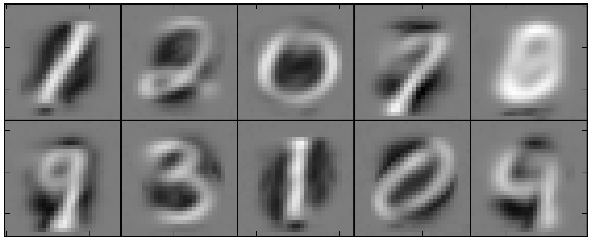
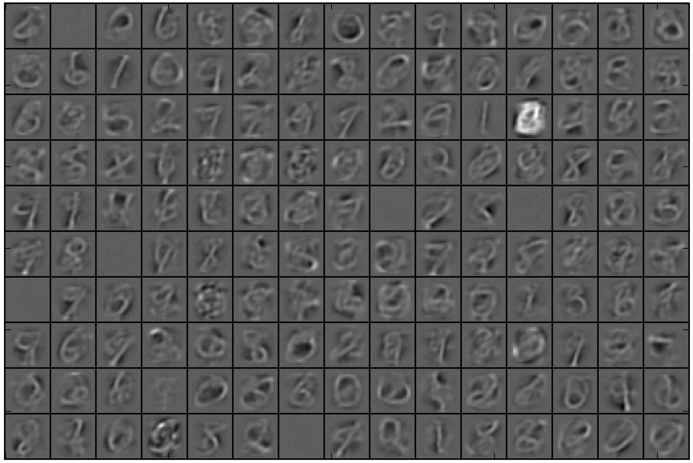

# rbm-examples

This repository contains Python code that implements a restricted Boltzmann machine and tests it using the
[MNIST dataset](http://yann.lecun.com/exdb/mnist). MNIST is a standard dataset used to benchmark
machine learning algorithms and consists of 28x28 pixel images of handwritten digits, 0-9, with corresponding
labels. There are 60,000 training images and 10,000 test images and the aim is to correctly identify the digit
in each image.
The code here was written as an exercise to learn about RBMs and their properties
(the MNIST data is not included and is assumed to be in a subdirectory named "common").
Results using methods that achieve higher classification accuracy can be found
[here](http://yann.lecun.com/exdb/mnist).

## What the code does

The code is capable of running 3 types of model,
each of which is trained on the training images and then applied to the test images:
* A multinomial regression on the image pixels
* An RBM followed by a multinomial regression on the hidden nodes. The RBM is first trained on the image data without
using the labels, and then the hidden node values are fed into the regression model (which uses the image labels)
* A multi-layer RBM followed by a multinomial regression on the hidden nodes of the final layer.
The idea here is that each successive layer of the RBM can learn a more succinct representation of the
probability distribution of the input data, which could potentially improve the classification.

As a test the RBM was trained for 2000 iterations using batches of 100 images.
A rectilinear activation function was used.
The learning rate was set to 0.03 with a weight decay of 0.0005.
No attempt was made to optimize the batch size, learning rate, or weight decay parameters.

Although the weights are learned by the RBM without using any of the images labels,
remarkably the values of the hidden nodes give a good representation of the data.
Even with only 10 hidden nodes the network learns to capture the main features of the digits:

Each 28x28 pixel square in the figure represents the weights connected to 1 hidden node.
If these weights were used as the inputs to backpropagation the backprop algorithm
would likely converge very rapidly!
Using 150 hidden nodes:

## Results

The multinomial regression was able to achieve an accuracy
(defined as number of images correctly identified / total number of images)
of 92.42%. With the single-layer RBM the results are:

<table style="width:50%">
  <tr>
    <th>Number of hidden nodes</th>
    <th>Accuracy [%]</th> 
  </tr>
  <tr> <td align="center"> 784 </td> <td align="center"> 91.25 </td> </tr>
  <tr> <td align="center"> 350 </td> <td align="center"> 91.53 </td> </tr>
  <tr> <td align="center"> 200 </td> <td align="center"> 91.01 </td> </tr>
  <tr> <td align="center"> 150 </td> <td align="center"> 91.43 </td> </tr>
  <tr> <td align="center"> 50  </td> <td align="center"> 81.35 </td> </tr>
  <tr> <td align="center"> 10  </td> <td align="center"> 50.48 </td> </tr>
</table>

The performance is worse with the RBM! I'm a little skeptical of these results since, for example,
[this site](http://www.pyimagesearch.com/2014/06/23/applying-deep-learning-rbm-mnist-using-python)
reports an improved classification using an RBM. When I have some more time
I plan to double-check these results, possibly using Tensor Flow since there are multiple examples
[applying it to MNIST data](https://www.tensorflow.org/versions/r0.10/tutorials/mnist/pros/index.html#deep-mnist-for-experts).

